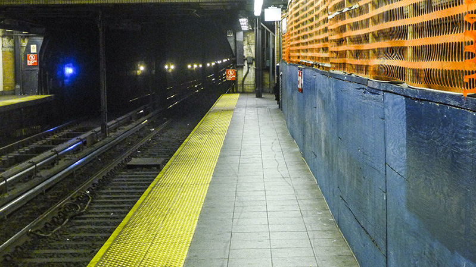

### Week 6: jQuery, events, and images

[Topics in Web Programming: JavaScript](https://github.com/ccny-edm/javascript)  
Instructor: [Dan Phiffer](http://phiffer.org/)

This week we are going to set aside our Mad Lib project and move on to something new using jQuery. In the most recent iteration of the [Mad Lib saga](https://github.com/ccny-edm/javascript-week05), we delayed replacement of words using something called an event listener. That is, instead of asking for all the word replacemens all up front, we *waited* until the "click" event occurred for each one. We are going to use event listeners again, but this time with jQuery instead of the Document Object Model. We will use them to create a very simple image slideshow.

#### Part 1: Forking it

Let's begin by doing something new in GitHub. Scroll to the top of this page and you should see a button at the top right that says “fork.” Clicking on the “fork” button will make an exact copy of this repository within your GitHub account. You can make changes and they will be stored separately from the original. This will serve as a starting point for the slideshow assignment. Instead of creating everything from scratch, you’ll have jQuery, an images folder, and a working example of the slideshow.

So let's do it now. If you haven't already, click the fork button up above. You can scroll back down when you're done. You should now be reading a forked version of README file, in a repository under your own account. The way you can tell is if the URL of the webpage includes your GitHub username.

#### Part 2: Cloning it

What you need to do next is clone this repository (the forked one) onto your own computer. Copy the URL from the sidebar under the button that says settings. Now open up the command line terminal, type in `cd ~/Desktop` and then `git clone [url]` (replacing "[url]" with the URL that you just copied).

You should see a new 'javascript-week06' folder appear on your desktop. Try opening up 'slideshow.html' in your browser and see if you can get it to work. We are going to rebuild this example *almost* from scratch. But before we get to that, we'll need some photos—more than 3, less than 10. Just download some high resolution photos, somewhere between 800—1024 pixels wide is good, to use for your version of the slideshow. Replace the cat pictures in the 'images' folder, with your selections, and name them 1.jpg, 2.jpg, 3.jpg, etc.

#### Part 3: Starting over

Open up slideshow.html in your text editor, and delete all the stuff in between the `<script>` and the `</script>` tags. You should end up with a file that looks something like this:

```html
<!DOCTYPE html>
<html>
    <head>
        <meta charset="utf-8">
        <title>Slideshow</title>
    </head>
    <body>
        
        <script src="jquery-1.11.0.js"></script>
        <script>
        
        </script>
    </body>
</html>
```

The idea here is that even though you have the completed assignment code, I'd like you to commit each step of the process it takes to build it. Basically I'd like you to show your work along the way.

Save your file and commit the change using `git commit -am "Starting over"` and then push your commit to GitHub using `git push -u origin master`.

#### Part 4: Listening for clicks

Let's add our jQuery event handler. In many ways this is the core of the slideshow.

```html
<script>

$('#image').click(function() {
    console.log('hi');
});

</script>
```

This code uses the jQuery `$` function to find all the elements on the page with an ID attribute set to 'image' (the `#image` selector), and uses the `.click()` method to listen for when the user clicks. The function we're passing to `.click()` is just a block of code that will execute later, when the user clicks on the image.

In this case clicking on the image will show a message 'hi' in the Firebug console.

Before continuing to this next step, commit your changes and push them to GitHub. The commands will look something like this:

```
git commit -am "Click listener"
git push
```

Note that we didn't have to specify `origin master` this time. This is because we used the `-u` argument to "set the upstream" that Git will push to normally.

#### Part 5: Swapping the image

Now let's advance the image on click, for now we'll just go to the second image.

```html
<script>

$('#image').click(function() {
    this.src = 'images/2.jpg';
});

</script>
```

Try the slideshow out. If it doesn't work, double check that your 'images' folder has the files you chose, and that they're named 1.jpg, 2.jpg, etc.

The variable `this` is special; it gets assigned automatically according to the *context* that the function is running in. jQuery does a clever thing where whichever element was clicked on is available as the variable `this` inside the click handler function. (Note: this is not the case with DOM event listeners, like with `.addEventListener()`.)

Now let's add a variable `num` to keep track of which image we're currently showing.

```js
var num = 1;
$('#image').click(function() {
    num++;
    var image = 'images/' + num + '.jpg';
    this.src = image;
});
```

You should now have a slideshow that shows each of your images in a sequence. We're getting closer!

Again, commit your changes like we did in the previous step. Committing often is a good habit to get into. Choose an informative commit message, the part after `-m` between the quotes.

#### Part 6: Wrapping back around to the first image

One problem with the current code is that if you click on the image to advance past the last item, it tries to show another image that doesn't exist. We can add a conditional to account for this situation.

First, let's define a new variable `max` that is set to the *total number of images* you have chosen for the slideshow. In the case of this example, there are 4 images, but you may have more or less than that. Set your `max` value accordingly.

```js
var num = 1;
var max = 4;
$('#image').click(function() {
    num++;
    var image = 'images/' + num + '.jpg';
    this.src = image;
});
```

Now we can add the conditional, to check whether `num` has gone beyond the maximum number of images. When that happens, we can just set `num` back to its original value, 1.

```js
var num = 1;
var max = 4;
$('#image').click(function() {
    num++;
    if (num > max) {
        num = 1;
    }
    var image = 'images/' + num + '.jpg';
    this.src = image;
});
```

Once again, commit your changes and push to GitHub.

#### Part 7: Extra credit

See if you can figure out how the fading in and fading out works from the original example. You find the [original example file](https://github.com/ccny-edm/javascript-week06/blob/master/slideshow.html) on GitHub, and study how it works. See if you can replicate the fading in and out. See if you can make sense of the [`.fadeIn()` API documentation](http://api.jquery.com/fadein/) to change the duration and easing of the fading.

This last part is not required, but feel free to embelish if you're looking to take this one further!
